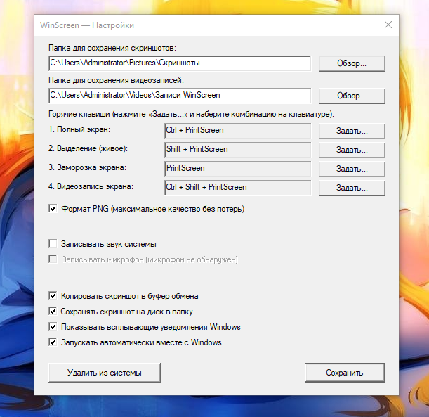

# WinScreen

Быстрая и легковесная утилита для скриншотов и видеозаписи экрана на **Windows 10 / 11**. Полностью на русском языке.

## ⚡ Возможности

- 🖥️ **Полный экран** — моментальный снимок всех мониторов
- 📐 **Выделение области (живое)** — фон под курсором остаётся «живым»
- ❄️ **Заморозка экрана** — стоп-кадр для точного захвата видео, игр и всплывающих меню
- 🎥 **Видеозапись экрана** — запись в MP4 со звуком системы и микрофоном
- 📋 Мгновенное копирование в буфер обмена и сохранение на диск
- 🔔 Уведомления Windows
- ⚙️ Настраиваемые горячие клавиши
- 🚀 Автозагрузка вместе с Windows

## 📸 Скриншот

## 📥 Скачать

1. Перейдите на страницу [**Releases**](../../releases)
2. Скачайте последний файл **`WinScreen.exe`** (~500 КБ)
3. Запустите — программа автоматически установится в систему и появится в трее

> Не требует Python, дополнительных библиотек или установки. Один файл — и всё работает.

## 🔑 Горячие клавиши по умолчанию

| Комбинация | Действие |
| :--- | :--- |
| `Ctrl + PrintScreen` | Полный экран |
| `Shift + PrintScreen` | Выделение области (живое) |
| `PrintScreen` | Заморозка экрана |
| `Ctrl + Shift + PrintScreen` | Видеозапись экрана |
| `Esc` / ПКМ | Отмена |

Все горячие клавиши можно переназначить в настройках.

## 📄 Лицензия

[MIT](LICENSE)

---

  

